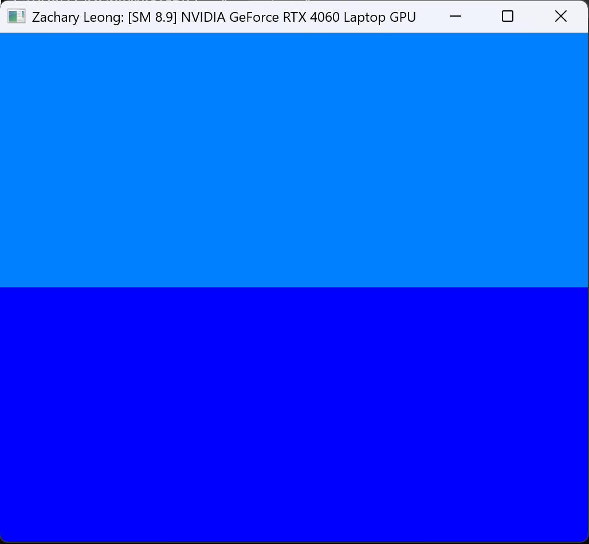
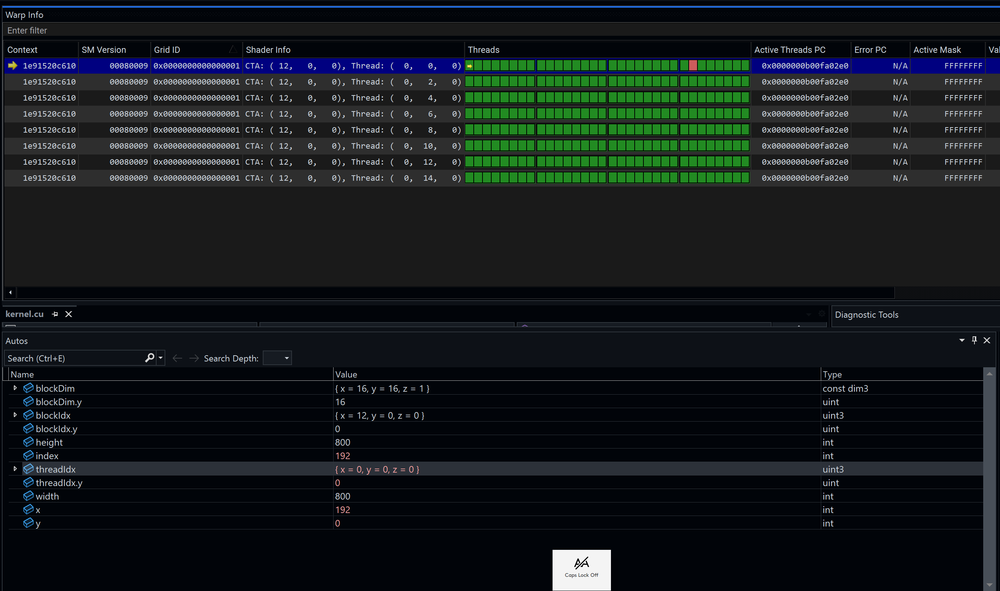
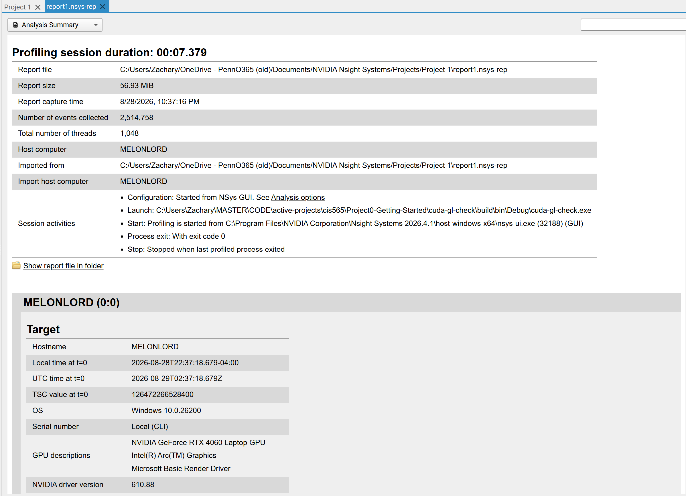
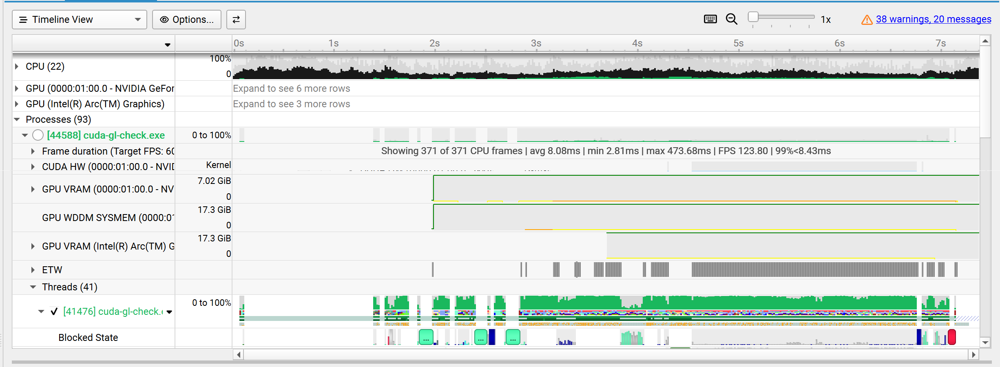
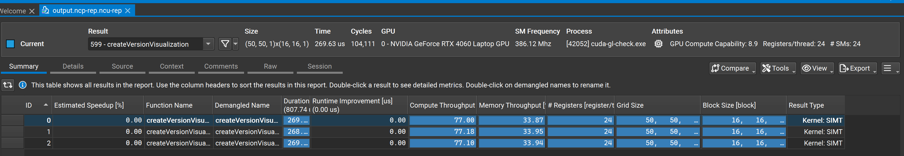
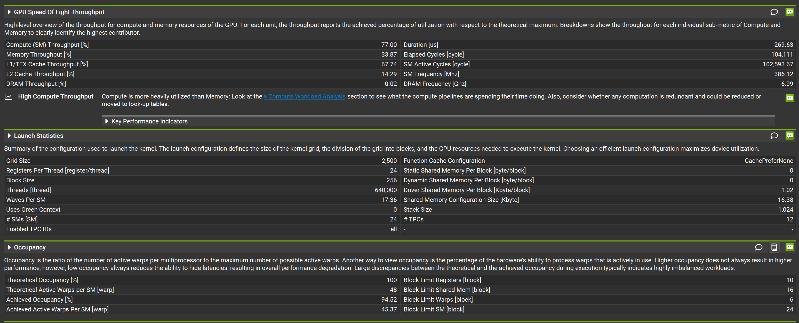
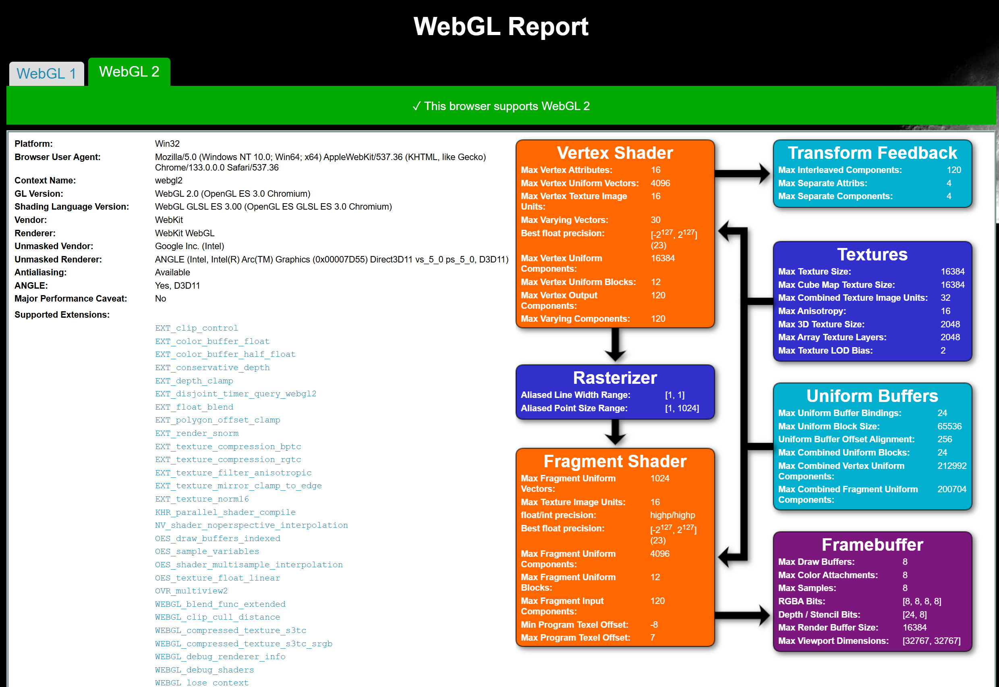
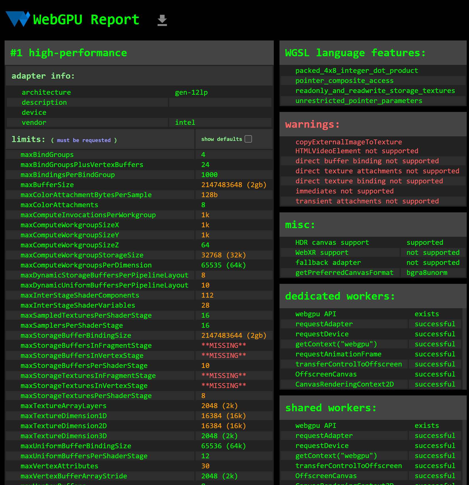

Project 0 Getting Started
====================

**University of Pennsylvania, CIS 5650: GPU Programming and Architecture, Project 0**

* Zachary Leong
  * [LinkedIn](https://linkedin.com/in/zleong), [personal website](https://zacharyleong.com)
* Tested on: Windows 11, Ultra 9 185H @ 2.30GHz 32GB, RTX 4060 Laptop (personal)

### images

